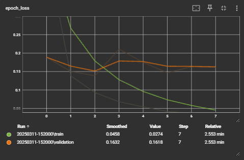
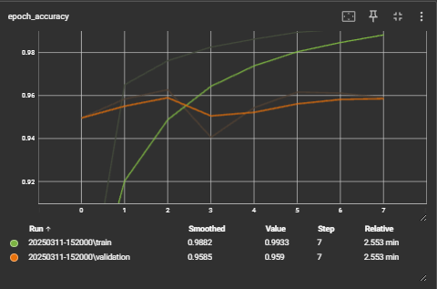

# E-commerce Product Categorization with LSTM

This project focuses on building a machine learning model to categorize e-commerce products into one of four categories: **Electronics**, **Household**, **Books**, and **Clothing & Accessories**. The model is built using **TensorFlow** and **LSTM (Long Short-Term Memory)** networks. The dataset is publicly available on Kaggle and contains text data from product descriptions.

## Project Overview

Text documents are one of the richest sources of data for businesses. Many e-commerce platforms use product categorization to help users easily find products based on their interests. However, the categorization of products is often done manually and retrospectively, which is time-consuming and resource-intensive. This project automates the process of product categorization using a machine learning model.

### Objective

The goal of this project is to develop a machine learning model that can classify product descriptions into the following four categories:
- **Electronics**
- **Household**
- **Books**
- **Clothing & Accessories**

Performance Evaluation
After training and evaluating the model, the following performance metrics were obtained:

F1 Score (Per Class)
The model's F1 score per class gives us an insight into the model's performance in each category. Higher values indicate better performance in that category:

Electronics: 0.9647
Household: 0.9793
Books: 0.9559
Clothing & Accessories: 0.9377
These results indicate that the model performs exceptionally well in all categories, particularly in Household and Electronics, with F1 scores above 0.96.

Overall F1 Score
Weighted F1 Score: 0.9585
The weighted F1 score gives an overall measure of the model's performance across all categories, accounting for the imbalanced class distribution. A score of 0.9585 is a strong indication of good overall performance.

Accuracy
Model Accuracy: 95.84%
The accuracy of 95.84% demonstrates that the model classifies the product descriptions correctly in nearly 96% of cases, showing great effectiveness in categorizing unseen products.

Confusion Matrix
The confusion matrix provides detailed information about the model's predictions. Each row of the matrix represents the true class, and each column represents the predicted class. The diagonal elements represent correct classifications, while the off-diagonal elements represent misclassifications.

## Project Structure

- `ecommerce_products.csv`: Dataset containing product descriptions and their corresponding categories.
- `product_categorization.ipynb`: Jupyter Notebook containing the model building, training, and evaluation code.
- `logs/`: Directory where TensorBoard logs are stored for tracking model training.
